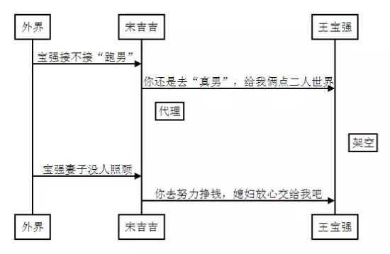

<h2>代理模式：女朋友这么漂亮，你缺经纪人吗？</h2>

你缺经纪人吗？

这几天王宝强妻子出轨经纪人事件惹尽了眼球，“你缺经纪人吗” 一下子成为打招呼必备热词。在紧跟“潮流”之前我们有必要了解下，经纪人都负责为宝强做哪些事呢？

- 为宝强安排档期
- 为宝强做公关
- 为宝强照顾家庭

可以看到，除了吃喝拉撒睡，宝强的许多行为都被经纪人 架空 了：

可以看出，经纪人会将外界给宝强的信息进行拦截、处理，这就是我们常说的代理模式。

代理模式定义
>为其他对象提供一种代理以控制对这个对象的访问。  
>Provide asurrogate or placeholder for another object to control access to it.